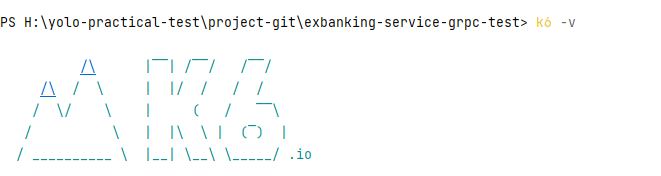
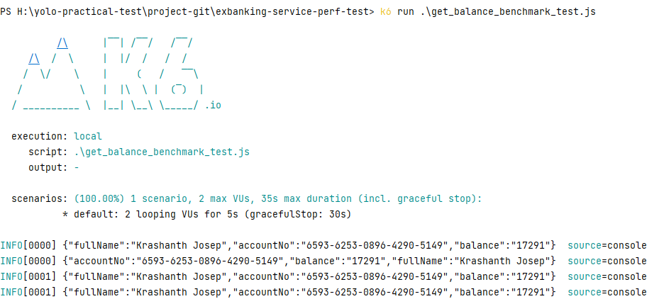
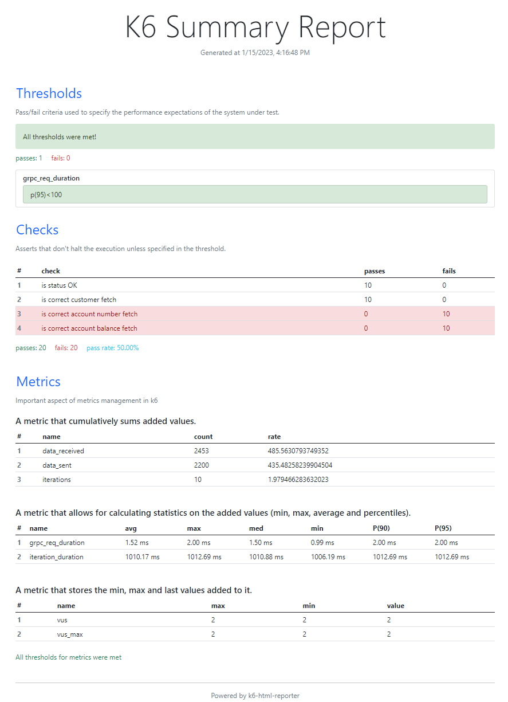

# exbanking-service-perf-test
*exbanking-service-perf-test* automated suite will maintain Exbanking service grpc functional test cases. This gRPC functional test automation project is a combination of JavaScript programming language and Cypress.io In addition, to enable a grpc mock  client, a customized solution with @grpc/proto-loader and @grpc/grpc-js npm lib are being used in this async test automation platform.

## Step 01 : Install K6 in Local Machine
Windows User : Click on the link [K6 Downlaod .exe](https://dl.k6.io/msi/k6-latest-amd64.msi)

MAC/Linux Users : Download from official site [K6 Installer](https://k6.io/docs/get-started/installation/)

Once download and install .exe make sure K6 setup installation successful :radioactive: with below commond
```bash
$ k6 -v
```


## Step 01 : Clone gRPC Non-Functional Perf Test Project
Clone [exbanking-service-perf-test](https://github.com/shiwanthaL/exbanking-service-perf-test) github project in your running machine
```bash
$ git clone https://github.com/shiwanthaL/exbanking-service-perf-test.git
```
Install package.json dependencies by staying root directory
```bash
$ npm install
```
## Step 02 : gRPC Server Setup and Installation
As a Prerequisite to execute non-functional perf testcases, please follow below instructions to get up and running Exbank gRPC endpoint,

1. Open separate bach (cmd) window on project root directory

2. Get up and running gRPC service endpoints using below command :radioactive: (***Don't close terminal until perf testcases execution complete***)
```bash
$ java -jar exbanking-service-protobuf-endpoints.jar
```

## Step 03 : Execute Exbank service level Non-functional Perf Testcases

Open new bash terminal and go to :radioactive: **exbanking-service-perf-test root directory** using separate bash and execute below commands
```bash
$ npm install
```
Execute Exbanking service level smoke test suite
```bash
$ k6 run .\get_balance_benchmark_test.js
```


## Step 04 : Analysis Execution Result (Threshold & Checks & Metrics)
Execution result will generate under root directory folder called "YOLOReport"
Open :radioactive: **report.html** file in browser and do analysis perf statistics.



**Note:** For reporting purpose 2 check points has deliberately failed while execution and below context covered in results
- 1 Threshold Validation = :white_check_mark:
- 2 Passed Check Points (Assert) = :white_check_mark:
- 2 Failed Check Points (Assert) = :white_check_mark:

- Metrics : Cumulative throughput = :white_check_mark:
- Metrics : Calculated statistics (min/ max/ avg/ percentile) = :white_check_mark:
- Metrics : Virtual users gen. behaviours = :white_check_mark:
- Console Display Req,Res details and Metrics = :white_check_mark:
- Result in .json format for dashboard integration (datadog, grafana, etc..) = :white_check_mark:
- Dynamic load gen. with implicit data reaction (setup/teardown) = :white_check_mark:
- Demonstrate 'load-test(benchmark type)' project here but, extensible for volume-test/stress-test/soak-test = :white_check_mark:

---

**Tools & NPM Used major libraries :**  [K6](https://k6.io/docs/)  |  [k6-html-reporter](https://www.npmjs.com/package/k6-html-reporter) 

## License
[MIT](https://choosealicense.com/licenses/mit/)