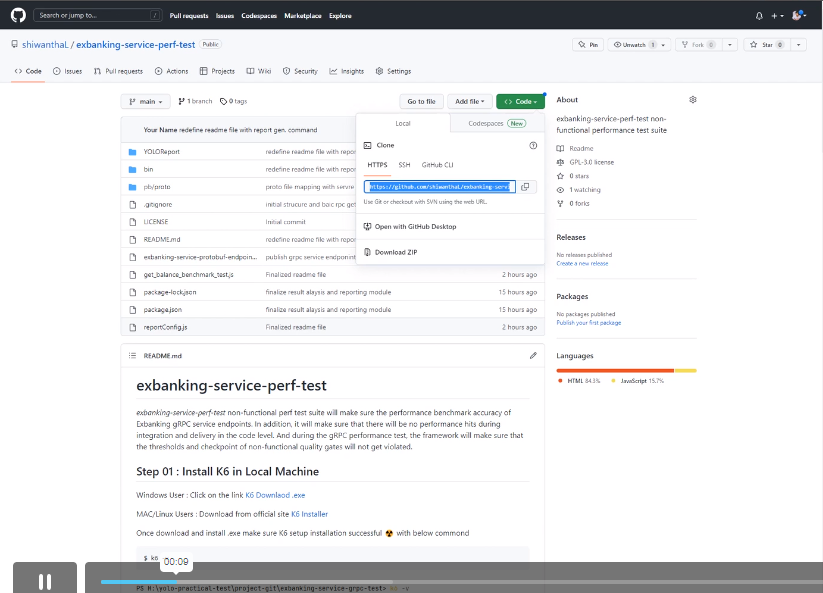
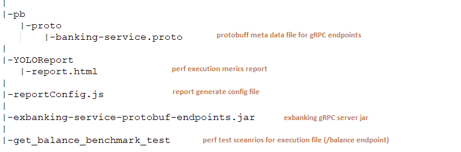
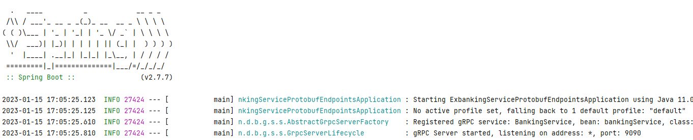

# exbanking-service-perf-test
*exbanking-service-perf-test* non-functional perf test suite will make sure the performance benchmark accuracy of Exbanking gRPC service endpoints. In addition, it will make sure that there will be no performance hits during integration and delivery in the code level. And during the gRPC performance test, the framework will make sure that the thresholds and checkpoint of non-functional quality gates will not get violated.
## Project demo gRPC protobuf Load test with K6

<p align="center">
  <a href="https://player.vimeo.com/video/789449287">
    
  </a>
</p>


## Step 01 : Install K6 in Local Machine
Windows User : Click on the link [K6 Downlaod .exe](https://dl.k6.io/msi/k6-latest-amd64.msi)

MAC/Linux Users : Download from official site [K6 Installer](https://k6.io/docs/get-started/installation/)

Prerequisites:
```bash
Java JDK  (Support Java 11 or above)
Node.js
```
Once downloaded and installed, open bash terminal and give following command to make sure that K6 setup installation is successful. ☢️
```bash
> k6 -v
```


## Step 02 : Clone gRPC Non-Functional Perf Test Project
Clone [exbanking-service-perf-test](https://github.com/shiwanthaL/exbanking-service-perf-test) github project in your running machine
```bash
> git clone https://github.com/shiwanthaL/exbanking-service-perf-test.git
```
Install package.json dependencies by staying root directory
```bash
> npm install
```
### Project structure
Understand gRPC non-functional service test project major folder hierarchy

## Step 03 : gRPC Server Setup and Installation
As a Prerequisite to execute non-functional performance testcases, please follow below instructions to get up and running Exbank gRPC endpoint,

1. Open separate bash (cmd) window on project root directory

2. Get up and running gRPC service endpoints using below command :radioactive: (***Don't close terminal until performance testcases execution complete***)
```bash
> java -jar exbanking-service-protobuf-endpoints.jar
```


## Step 04 : Execute Exbank service level Non-functional Perf Testcases

Open new bash terminal and go to :radioactive: **exbanking-service-perf-test root directory** using separate bash and execute below commands
```bash
> npm install
```
Execute Exbanking service level smoke test suite
```bash
> k6 run get_balance_benchmark_test.js
```


### Generate Detail Summary Report
```bash
> node reportConfig.js
```


## Step 05 : Analysis Execution Result (Threshold, Checks & Metrics)
Execution result will generate under root directory folder called "YOLOReport"
Open :radioactive: **report.html** file in browser and do analysis perf statistics.


**Note:** For reporting purpose 2 check points has deliberately failed while execution and below context covered in results
- 1 Threshold Validation = :white_check_mark:
- 2 Passed Check Points (Assert) = :white_check_mark:
- 2 Failed Check Points (Assert) = :white_check_mark:

- Metrics : Cumulative throughput = :white_check_mark:
- Metrics : Calculated statistics (min/ max/ avg/ percentile) = :white_check_mark:
- Metrics : Virtual users gen. behaviours = :white_check_mark:
- Console Display Req,Res details and Metrics = :white_check_mark:
- Result in .json format for dashboard integration (datadog, grafana, etc..) = :white_check_mark:
- Dynamic load gen. with implicit data reaction (setup/teardown) = :white_check_mark:
- Demonstrate 'load-test(benchmark type)' project here but, extensible for volume-test/stress-test/soak-test = :white_check_mark:

---

**Tools & NPM Used major libraries :**  [K6](https://k6.io/docs/)  |  [k6-html-reporter](https://www.npmjs.com/package/k6-html-reporter) 

## License
[MIT](https://choosealicense.com/licenses/mit/)